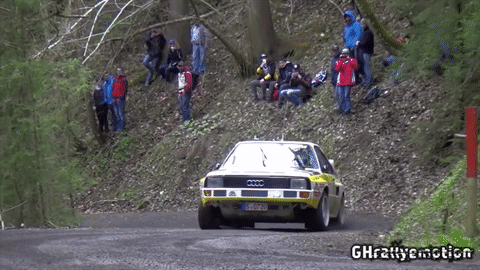

# Colab-Super-SloMo [](https://opensource.org/licenses/mit-license.php)
## Simply download `Colab-Super-SloMo.ipynb` and open it inside your Google Drive or click [here](https://colab.research.google.com/github/styler00dollar/Colab-Super-SloMo/blob/master/Colab-Super-SloMo.ipynb) and copy the file with "File > Save a copy to Drive..." into your Google Drive. 
### 

PyTorch implementation of "Super SloMo: High Quality Estimation of Multiple Intermediate Frames for Video Interpolation" by Jiang H., Sun D., Jampani V., Yang M., Learned-Miller E. and Kautz J. [[Project]](https://people.cs.umass.edu/~hzjiang/projects/superslomo/) [[Paper]](https://arxiv.org/abs/1712.00080)

__Check out [our paper](https://github.com/avinashpaliwal/Deep-SloMo) "Deep Slow Motion Video Reconstruction with Hybrid Imaging System" published in TPAMI.__

## Important information

- If you can't open `Colab-Super-SloMo.ipynb` inside your Google Drive, try this [colab link](https://colab.research.google.com/github/styler00dollar/Colab-Super-SloMo/blob/master/Colab-Super-SloMo.ipynb) and save it to your Google Drive. The "open in Colab"-button can be missing in Google Drive, if that person never used Colab.
- Google Colab does assign a random GPU. It depends on luck.
- The Google Colab VM does have a maximum session length of 12 hours. Additionally there is a 30 minute timeout if you leave colab. The VM will be deleted after these timeouts.

## Results
Results on UCF101 dataset using the [evaluation script](https://people.cs.umass.edu/~hzjiang/projects/superslomo/UCF101_results.zip) provided by paper's author. The `get_results_bug_fixed.sh` script was used. It uses motions masks when calculating PSNR, SSIM and IE.

| Method | PSNR | SSIM | IE |
|------|:-----:|:-----:|:-----:|
| DVF | 29.37 | 0.861 | 16.37 |
| [SepConv](https://github.com/sniklaus/pytorch-sepconv) - L_1 | 30.18 | 0.875 | 15.54 |
| [SepConv](https://github.com/sniklaus/pytorch-sepconv) - L_F | 30.03 | 0.869 | 15.78 |
| SuperSloMo_Adobe240fps | 29.80 | 0.870 | 15.68 |
| **pretrained mine** | **29.77** | **0.874** | **15.58** |
| SuperSloMo | 30.22 | 0.880 | 15.18 |





## Prerequisites
This codebase was developed and tested with pytorch 0.4.1 and CUDA 9.2 and Python 3.6.
Install:
* [PyTorch](https://pytorch.org/get-started/previous-versions/)

For GPU, run
```bash
conda install pytorch=0.4.1 cuda92 torchvision==0.2.0 -c pytorch
```
For CPU, run
```bash
conda install pytorch-cpu=0.4.1 torchvision-cpu==0.2.0 cpuonly -c pytorch
```
* [TensorboardX](https://github.com/lanpa/tensorboardX) for training visualization
* [tensorflow](https://www.tensorflow.org/install/) for tensorboard
* [matplotlib](https://matplotlib.org/users/installing.html) for training graph in notebook.
* [tqdm](https://pypi.org/project/tqdm/) for progress bar in [video_to_slomo.py](video_to_slomo.py)
* [numpy](https://scipy.org/install.html)

### Pretrained model
You can download the pretrained model trained on adobe240fps dataset [here](https://drive.google.com/open?id=1IvobLDbRiBgZr3ryCRrWL8xDbMZ-KnpF).


## References:
Parts of the code is based on [TheFairBear/Super-SlowMo](https://github.com/TheFairBear/Super-SlowMo)

